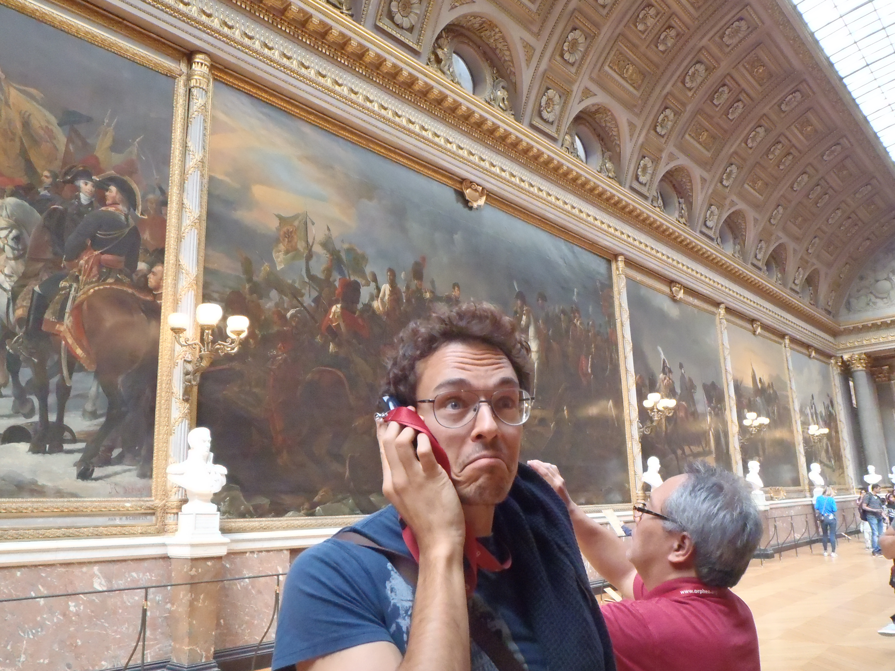

<br>

```{r pressure, echo=FALSE, fig.cap="", out.width = '55%', fig.align="center"}

```

<center>
[<i class="fa fa-envelope-o"></i>](mailto:matteo.fasiolo@bristol.ac.uk) \ \ \ \ [<i class="fa fa-institution"></i>](http://www.bristol.ac.uk/maths/people/matteo-fasiolo/index.html) \ \ \ [<i class="fa fa-graduation-cap"></i>](https://scholar.google.co.uk/citations?user=lu4oHaUAAAAJ&hl=en) \ \ \ [<i class="fa fa-twitter"></i>](https://twitter.com/fasiolo1985)
</center>

<center>
<a href="V_NOACCO_CV_02_07_2018#" class="download" title="CV">Curriculum Vitae</a>	

<br>
<br>


<br>

<a class="twitter-timeline" data-width="400" data-height="400" href="https://twitter.com/fasiolo1985?ref_src=twsrc%5Etfw">Tweets by fasiolo1985</a> <script async src="https://platform.twitter.com/widgets.js" charset="utf-8"></script>

