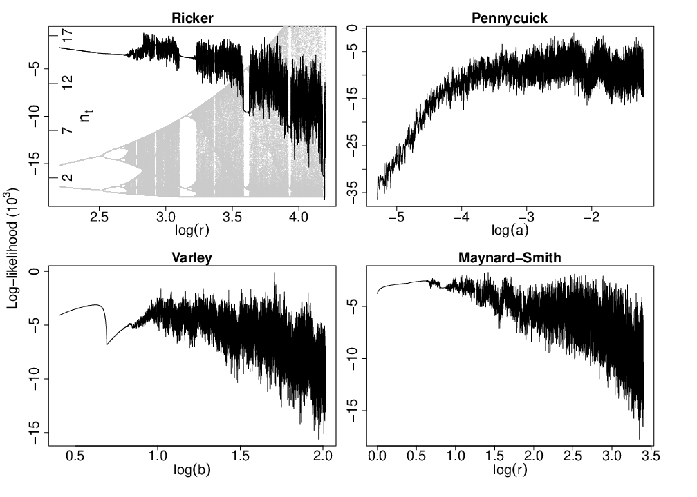

  
 
 

## R packages

 

### Generalized Additive Models 

The following packages are part of the output of my research on GAM models:

   - **mgcViz**: visual tools for Generalized Additive Models. See the github [source code](https://github.com/mfasiolo/mgcViz) and the [online manual](mgcViz/index.html). Available on [CRAN](https://cran.r-project.org/web/packages/mgcViz/index.html).
   

 

   
   - **qgam**: quantile additive model in R. See the github [source code](https://github.com/mfasiolo/qgam) and the [online manual](https://mfasiolo.github.io/qgam). Available on [CRAN](https://cran.r-project.org/web/packages/qgam/index.html).
   

 

   
 
 

### Monte Carlo methods and intractable likelihoods
   
I have also authored the following packages, related to my research on Monte Carlo methods and intractable likelihoods:

   - **mvnfast**: fast multivariate normal and student's t methods. See the github [source code](https://github.com/mfasiolo/mvnfast) and the [online manual](http://mfasiolo.github.io/mvnfast/). Available on [CRAN](https://cran.r-project.org/web/packages/mvnfast/index.html).
   

 

   
   - **synlik**: synthetic likelihood methods for intractable likelihoods. See the github [source code](https://github.com/mfasiolo/synlik) and the [vignette](https://cran.r-project.org/web/packages/synlik/vignettes/synlik.html). Available on [CRAN](https://cran.r-project.org/web/packages/synlik/index.html).
   

 

   - **esaddle**: tools for fitting the Extended Empirical Saddlepoint (EES) density. See the github [source code](https://github.com/mfasiolo/esaddle) and the [vignette](https://cran.r-project.org/web/packages/esaddle/vignettes/esaddle.html). Available on [CRAN](https://cran.r-project.org/web/packages/esaddle/index.html).
   

 

